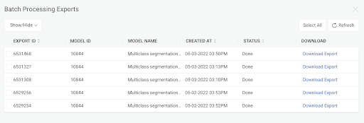
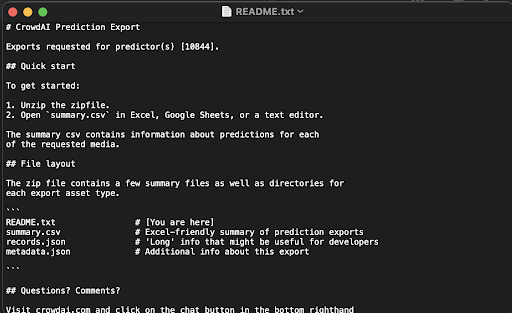
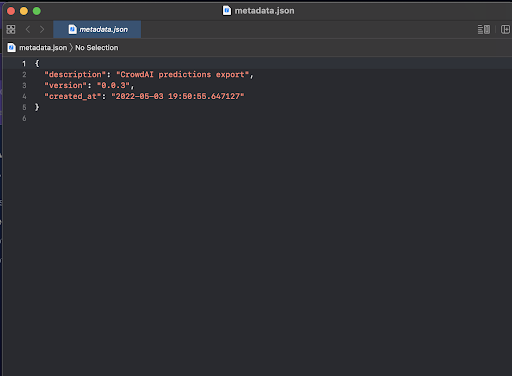

* TOC
{:toc}

## About Us:

Devesh Saini: Information Technology Major  
Jonathan Tikhonoff: Information Technology Major  
Joseph Mendis: Information Technology Major

## About Our Project:

Gallaudet Drone Video Analysis AI  
<iframe width="560" height="315" src= "https://www.youtube.com/embed/QJNUN0DDLWM">
</iframe>

## Questions/Problem:

What are the questions we want to answer? The toughest part is to create the questions for us to answer. We came up with…  
1.) What do we want to detect and measure on Gallaudet Campus using AI?  
2.) How many miles of road on-campus? (road detection)  
3.) How many buildings? (building detection)  
4.) How many trees on campus? (tree detection) 

## Project Scope:

> Each project team member train one AI to answer one specific question (either 2, 3, or 4).    
> Create a web application that show the result of AI analysis. Which is this you are looking at.

## Design:

In order to solve and address these problems/questions and begin our project scope, we used CrowdAI. CrowdAI is a computer vison platform where users can upload their own media and prepare them for machine learning purposes. Taking in those medias to become top-of-the-line training data for our or your own specifications using their annotationg tools. Also be able to train your own computer vison model with annotation data that is powered by CrowdAI's cutting-edge deep learning neural networks. With that model you can do something with it!

## Annotating - Phase 1, 2, & 3:

Phase 1: Inital Annotation: This is the first pass that anyone need to do on a video or picture. "Starting from scratch." In this phase there are specfic categories that the users make for each object they want to annotate. These categories have specific polygons attached to it where users will draw polygons on the media to annotate and label a certain part of it.  
Phase 2: Annotation Review: Phase 2 is all about quality control. This is a good part for having someone else to review the annotating work done in Phase 1 to make sure that everything is annotated correctly.  
Phase 3:  Final Review: This phase is optional but reccommend, pretty much simlar to phase 2, checking it again for one final review to make sure all the annotation media is correct and in high quality.

## Training:

Here are results from our training: We annotated more than 200 medias for each group. 
 
1.) Trees:  
<iframe width="560" height="315" src= "https://www.youtube.com/embed/Yqd2v5-vaD8">
</iframe>
2.) Buildings:  
<iframe width="560" height="315" src= "https://www.youtube.com/embed/ap_tFLDa5wc">
</iframe>
3.) Roads:  
<iframe width="560" height="315" src= "https://www.youtube.com/embed/prO7T1pZADw&t=22s">
</iframe>

## Results/Demo:

We were able to develop models but was unable to export it analyze external medias.  
   
   
   

## Issues/Feedbacks:

1.) Unable to use AI to analyze videos due to issues with AWS. CrowdAI engineers are currently looking into it.  
2.) Video resolution issues.  
3.) Annotating issues.  
4.) Learning to use CrowdAI platform - not beginner friendly.  

## Conclusions:
AI is modeled after how our brain works at basic level. A cutting edge experimentation in understanding how our brain works.   

AI is a tool like any hammer or knife.   

Just as people can use AI to attack, we can use AI to defend or improve our lifestyle such as stoplight system (use Los Angeles as an example) or meteorological analysis.   

With our work so far, we can continue this by working with CrowdAI engineers and staff to make our models work to analyze external medias. As well as continue to add more annotating to our previous categories to get a more accurate model. We can also devlop new categories to annotate and develop models for.   

In all we learned a lot about how AI & machine learning works and its possible implications on the real world. The models can be utilized to identify or measure various things. It can solve specfic problems using medias. 

